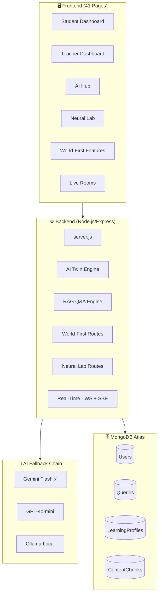

<div align="center">

# 🧠 TechTwin — AI Voice Teacher Assistant

[](https://nodejs.org)
[](https://expressjs.com)
[](https://mongodb.com)
[](https://deepmind.google/technologies/gemini/)
[](https://openai.com)
[](https://elevenlabs.io)
[](LICENSE)

<br/>

> **"The Intelligence Engine for Modern Academic Institutions"**

### 🌍 31 World-First AI Features · 4-Role System · Real-Time Collaboration · Voice Intelligence

<br/>

**TechTwin** is not just a Q&A chatbot — it's a complete **AI-powered academic operating system** that creates a personal **AI Digital Twin** for every student. It learns how you think, detects your confusion in real-time, predicts your next doubts, and adapts its teaching style dynamically.

<br/>

---

</div>

## ✨ What Makes TechTwin Different?

| 🎯 Feature | 💡 Description |
|---|---|
| 🤖 **AI Digital Twin** | Your personal AI that learns YOUR behavior and adapts to YOU |
| 🔮 **Pre-Ask AI** | Predicts your next 3 questions *before* you even ask |
| 🎭 **Teacher Style Cloning** | AI mimics any teacher's unique explanation style |
| 🧬 **Silent Misunderstanding Scanner** | Detects if you *truly* understand or just memorized |
| 📖 **AI Personal Textbook** | Writes a complete textbook *personalized just for you* |
| 🎙️ **Voice Emotion Mirror** | Detects confusion/frustration from your voice in real-time |
| 🔬 **Exam Reverse-Engineering** | Analyzes past papers → predicts your next exam questions |
| 🧠 **Thought Constellation** | Visualizes your knowledge as an interactive galaxy 🌌 |

---

## 🏗️ Tech Stack

```
🖥️  Frontend   →  HTML5 · CSS3 · Vanilla JavaScript (41 pages)
⚙️  Backend    →  Node.js + Express.js v5 (ES Modules)
🗄️  Database   →  MongoDB Atlas (Mongoose ODM + Native Driver)
🤖  AI (Primary)  →  Google Gemini Flash
🤖  AI (Fallback) →  OpenAI GPT-4o-mini → Ollama Local (llama3.2)
🎙️  Voice/TTS  →  ElevenLabs Multilingual v2
📐  Embeddings →  Xenova/Transformers (all-MiniLM-L6-v2, 384-dim)
⚡  Real-Time  →  WebSocket (ws) + Server-Sent Events (SSE)
🔐  Auth       →  JWT + bcryptjs + Role-Based Middleware
```

---

## 🚀 Features (All 31+)

<details>
<summary><b>🧠 Core AI Twin System (10 Features)</b></summary>

- 🤖 **AI Digital Twin** — Personal AI that learns your behavior and adapts
- 🔮 **Pre-Ask AI** — Predicts next 3 questions before you ask
- 📊 **Adaptive Difficulty** — Auto-adjusts beginner → intermediate → advanced
- 😤 **Confusion Detection** — Detects frustration/confusion from text tone
- 🧠 **Memory-Based AI** — Remembers your recent topics for context
- 📝 **Auto Quiz Generator** — MCQ quizzes on any topic, any difficulty
- ⚡ **Instant Revision Mode** — Exam-ready summaries from your past doubts
- 🗺️ **Concept Dependency Map** — Interactive node graph of prerequisites
- 📡 **Weakness Radar** — Subject strength heatmap
- 🔥 **Streak System** — Daily learning streaks with XP + milestone notifications

</details>

<details>
<summary><b>🎯 Multi-Mode Teaching (5 Modes)</b></summary>

- 👶 **Simple Mode** — Explain like teaching a child
- 🔬 **Technical Mode** — Precise, in-depth technical answers
- 💻 **Example Mode** — Only code examples and scenarios
- 🌍 **Real-Life Mode** — Real-world analogies, zero jargon
- 🤫 **Whisper Mode** — Ultra-concise 2–3 bullet points

</details>

<details>
<summary><b>🔬 Neural Lab — 5 Experimental Features</b></summary>

- 🌌 **Thought Constellation** — Concepts visualized as an interactive galaxy
- 📉 **Memory Decay Radar** — Ebbinghaus forgetting curve tracking
- ⏰ **Learning Rhythm** — Discovers your biological learning clock (Morning Bird vs Night Owl)
- ⚔️ **Concept Battlefield** — Two concepts battle, AI judges the winner
- 🦎 **AI Mood Chameleon** — 5 personas: Zen Master, Calm Guide, Idea Spark, Night Light, Hyperdrive

</details>

<details>
<summary><b>🌍 World-First Features — 7 Features</b></summary>

- 📚 **AI Personal Textbook** — AI writes a complete textbook personalized for YOU
- 🎙️ **Voice Emotion Mirror** — Detects confusion/frustration from voice metrics
- 🎭 **Teacher Style Cloning** — AI mimics a specific teacher's explanation style
- 🔍 **Exam Reverse-Engineering** — Analyzes past papers, generates predicted exams
- 🚁 **Live Lecture Co-Pilot** — Real-time "I'm Lost" button during lectures
- 📋 **Post-Lecture Summary** — Auto flashcards + confusion point analysis
- 🔬 **Silent Misunderstanding Scanner** — Probes if you truly understand or just memorized

</details>

<details>
<summary><b>🤝 Social & Collaborative</b></summary>

- 🏠 **Live Doubt Rooms** — WebSocket-powered real-time rooms per subject
- 📈 **Trending Doubts** — Most voted/viewed questions rise to top
- 👍 **Peer Answer Voting** — Upvote/unvote system with auto-trending at 5 votes
- 🤖 **AI Doubt Clustering** — AI groups similar questions by topic

</details>

---

## 🏛️ Architecture



---

## 📐 RAG Pipeline

```
📄 Teacher uploads PDF
        ↓
📝 pdf-parse extracts text
        ↓
✂️  Chunked (500 words, 100 overlap)
        ↓
🔢 Xenova embeds each chunk (384 dims)
        ↓
💾 Stored in MongoDB contentchunks
        ↓
❓ Student asks question
        ↓
🔢 Question embedded via Xenova
        ↓
📊 Cosine similarity vs all chunks
        ↓
🏆 Top 3 chunks selected
        ↓
🤖 AI Fallback Engine generates answer
        ↓
✅ Contextual answer returned
```

---

## 🔐 Role System

```
🔴 Superadmin
    └── Creates → 🟠 HOD (Head of Department)
                      └── Approves → 🟡 Teacher
                                         └── Teaches → 🟢 Student
```

| Role | Key Permissions |
|---|---|
| 🔴 **Superadmin** | Full system control, create HODs, broadcast notifications |
| 🟠 **HOD** | Register & approve teachers, assign subjects |
| 🟡 **Teacher** | Upload PDFs, reply to doubts (requires HOD approval) |
| 🟢 **Student** | Ask doubts, use AI Twin, take quizzes, join live rooms |

---

## ⚡ Real-Time Systems

| System | Details |
|---|---|
| 🔌 **WebSocket** | `ws://localhost:5000/ws?subject=<subject>` — Live doubt rooms per subject |
| 📡 **SSE** | `/auth/sse/:userId` — Real-time AI & teacher reply notifications |
| 💓 **Heartbeat** | 20-second keep-alive ping |

---

## 🛠️ Local Setup

### Prerequisites
- Node.js v18+
- MongoDB Atlas account
- API keys (Gemini, OpenAI, ElevenLabs)

### Installation

```bash
# 1. Clone the repo
git clone https://github.com/YOUR_USERNAME/techtwin.git
cd techtwin

# 2. Install dependencies
npm install

# 3. Setup environment variables
cp .env.example .env
# Fill in your API keys in .env

# 4. Start the server
npm start
# Server runs on http://localhost:5000
```

### Environment Variables

```env
MONGO_URI=your_mongodb_atlas_uri
JWT_SECRET=your_jwt_secret
GEMINI_API_KEY=your_gemini_key
OPENAI_API_KEY=your_openai_key
ELEVENLABS_KEY=your_elevenlabs_key
SUPERADMIN_KEY=your_superadmin_secret
```

---

## 📊 Project Stats

| Metric | Value |
|---|---|
| 📁 Backend Files | ~42 files |
| 🖥️ Frontend Pages | ~41 files |
| 💻 Lines of Code | 2,500+ |
| 🛣️ API Endpoints | 50+ routes |
| ✨ AI Features | 31+ world-first |
| 🗄️ DB Collections | 5 |
| 👥 User Roles | 4 |
| 🤖 AI Providers | 3 (Gemini · OpenAI · Ollama) |

---

## 🗂️ API Reference

<details>
<summary><b>View all 50+ endpoints</b></summary>

| Route | Method | Description |
|---|---|---|
| `/auth/register` | POST | Register student/teacher |
| `/auth/login` | POST | Login with JWT |
| `/twin/profile/:userId` | GET | Get AI Twin learning profile |
| `/twin/ask-twin` | POST | Multi-mode AI answer |
| `/twin/pre-ask/:userId` | GET | Predict next 3 questions |
| `/ask/` | POST | RAG Q&A engine |
| `/quiz/generate` | POST | Generate MCQ quiz |
| `/trending/trending` | GET | Get trending doubts |
| `/wf/textbook/generate` | POST | AI Personal Textbook |
| `/wf/voice-emotion/ask` | POST | Voice Emotion Mirror |
| `/nl/constellation` | POST | Thought Constellation |
| `/nl/battle` | POST | Concept Battlefield |
| `/speak` | POST | ElevenLabs TTS |
| ... and 40+ more | | |

</details>

---

## 🤝 Contributing

Contributions, issues and feature requests are welcome!

1. Fork the repo
2. Create your branch (`git checkout -b feature/AmazingFeature`)
3. Commit your changes (`git commit -m 'Add AmazingFeature'`)
4. Push to the branch (`git push origin feature/AmazingFeature`)
5. Open a Pull Request

---

<div align="center">

**Built with ❤️ by [Your Name] · GLS University Ahmedabad**

⭐ **Star this repo if you found it helpful!** ⭐

</div>
